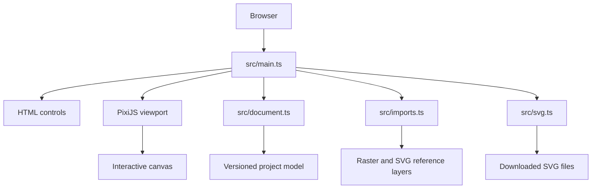

# SVG Draw Me

SVG Draw Me is a responsive browser drawing tool for artists and game-asset creators. It records individual mouse, touch, and stylus strokes so artwork can be exported as ordinary SVG or as an editable, stroke-preserving SVG artifact.

## Table of Contents

- [About](#about)
- [Features](#features)
- [Tech Stack](#tech-stack)
- [Architecture](#architecture)
- [Project Structure](#project-structure)
- [Getting Started](#getting-started)
- [Configuration](#configuration)
- [Security](#security)
- [How to Contribute](#how-to-contribute)
- [What's Next](#whats-next)
- [License](#license)
- [Acknowledgements](#acknowledgements)
- [Author](#author)

## About

SVG Draw Me uses a fixed project coordinate space and renders it responsively inside a PixiJS canvas. User strokes remain separate, ordered records containing points, timestamps, pointer type, pressure, and style data. Raster images can be used as tracing references, and SVG files can be imported as crisp vector reference layers.

The application currently runs entirely in the browser. Projects are held in memory while the page is open; exports are downloaded locally and no account or server is required.

## Features

| Feature | Description |
|---|---|
| Stroke-preserving drawing | Records separate ordered strokes and their point metadata instead of flattening directly to pixels. |
| Shape tools | Creates first-class lines, rectangles, ellipses, polygons, and curved lines with optional fills. |
| Fill bucket | Fills or clears tolerant closed hand-drawn loops and existing fillable shapes without flattening their geometry or stroke history. |
| Mobile menu | Collapses the toolbar to maximize drawing space on narrow screens. |
| Bounded workspace | Clips drawing and reference layers to an editable project canvas; importing a larger reference expands the canvas to contain it. |
| Whole-object eraser | Removes a complete touched stroke, shape, or reference layer and supports undo. |
| Pointer input | Supports mouse, touch, and pen/stylus pointer events. |
| Responsive workspace | Fits the current project coordinate space and centers it with letterboxing. |
| Zoom and navigation | Provides 25%–800% zoom, reset controls, pointer-centered wheel zoom, two-finger pinch-and-pan, a touch-friendly Pan tool, and Space/middle-mouse panning. |
| Grid overlay | Toggles a project-space grid with adjustable spacing to help align game-art details. |
| Raster tracing references | Imports PNG/JPG files as translucent reference layers. |
| SVG references | Imports SVG files through PixiJS vector parsing while preserving original markup in the project model. |
| Standard SVG export | Downloads visible artwork as a normal SVG document. |
| Editable SVG export | Downloads SVG geometry plus project metadata for stroke-preserving workflows. |
| Preset animation preview | Stores validated object/layer animations and previews fade, move, scale, rotate, draw, pulse, and emphasis presets with playback controls. |
| Layer editing | Adds, renames, reorders, hides, shows, and changes opacity for named layers. |
| Text objects | Adds editable text objects with font size, family, color, alignment, transforms, and SVG export. |
| Gradients | Applies two-color linear or radial fills to new filled shapes and preserves them in SVG export. |
| Constrained effects | Applies bounded blur effects to new filled shapes and preserves them in SVG export. |
| Curved path editing | Selects recorded curved paths and edits their endpoints and control point. |
| Project save and reopen | Saves the complete editable project, including reference layers, as a local `.svgdraw` file. |
| Undo and clear | Removes the last completed stroke or clears user strokes. |

## Tech Stack

- TypeScript with strict type checking.
- Vite 6 for development and production bundling.
- PixiJS 8.14 for rendering, pointer interaction, and SVG parsing.
- Vitest 5 for unit tests.
- Browser APIs: Pointer Events, FileReader, Blob/Object URLs, and downloads.

## Architecture

The app is a static client-side application. The canonical document model is independent from PixiJS rendering and is serialized into export metadata.



The viewport transform handles fit-to-canvas scaling, zoom, pan, and pointer coordinate conversion without modifying stored coordinates. Separate project-space transforms on objects and named layers apply consistently to PixiJS previews and SVG output. See [ADR-0001](docs/adr/0001-pixi-client-rendering.md), [ADR-0002](docs/adr/0002-stroke-preserving-document-model.md), and [ADR-0003](docs/adr/0003-vector-svg-reference-preview.md).

## Project Structure

- `src/main.ts` — application shell, controls, PixiJS setup, input handling, imports, and downloads.
- `src/types.ts` — versioned project, stroke, layer, transform, animation, and reference types.
- `src/document.ts` — project creation, cloning, serialization, deserialization, and stroke appending.
- `src/coordinates.ts` — viewport/project coordinate and zoom transform helpers.
- `src/imports.ts` — SVG Blob construction helper.
- `src/svg.ts` — standard and editable SVG generation.
- `src/transforms.ts` — shared project transform application for PixiJS and SVG.
- `src/animation.ts` — pure preset animation evaluation and timing behavior.
- `src/styles.css` — responsive application styling.
- `tests/` — document, coordinate, and import unit tests.
- `IMPLEMENTATION_PLAN.md` — implementation phases and completed follow-up fixes.
- `docs/` — user, administrator, ADR, changelog, and release documentation.

Tooling and editor configuration: `package.json`, `package-lock.json`, `tsconfig.json`, `vite.config.ts`, and `.gitignore`.

## Getting Started

### Prerequisites

- Node.js with npm. The project has been validated with the repository's npm toolchain; use a current Node.js LTS release.
- A modern browser with Pointer Events and WebGL or Canvas support.

### Install and run

```bash
npm install
npm run dev
```

Open the local URL printed by Vite. To validate the project:

```bash
npm test
npm run build
```

### GitHub Pages deployment

Pushes to `main` run the workflow in `.github/workflows/deploy-pages.yml`. It installs locked dependencies, runs the test suite, builds `dist/`, and publishes the result through the GitHub Pages deployment environment. It can also be started manually with **Actions → Deploy to GitHub Pages → Run workflow**.

The Vite build uses relative asset paths so the app works at the repository Pages URL:
`https://mcfuzzysquirrel.github.io/svg-draw-me/`.

## Configuration

The app has no environment variables, server configuration, authentication settings, or runtime configuration files. New projects start at 1200×800. Use the canvas width and height controls to resize the project; importing a larger reference expands it automatically. Grid spacing is also editable.

| Setting | Default | Purpose |
|---|---:|---|
| Project width | `1200` | Initial document coordinate width; editable in the toolbar. |
| Project height | `800` | Initial document coordinate height; editable in the toolbar. |
| Grid spacing | `50` | Initial project-space grid spacing; editable in the toolbar. |
| Zoom minimum | `0.25` | 25% viewport zoom. |
| Zoom maximum | `8` | 800% viewport zoom. |

Development and build commands are defined in `package.json`.

## Security

The application has no authentication, authorization, backend, or secret storage. Imported files are processed in the browser, and downloads are initiated locally. SVG files are loaded into PixiJS for preview and their original markup is preserved for export; users should treat imported SVG content as untrusted artwork and avoid opening untrusted exports in sensitive workflows.

To report a vulnerability, open a private GitHub security report for the repository owner or use a private maintainer contact route. Do not publish exploitable details in a public issue.

## How to Contribute

See [CONTRIBUTING.md](CONTRIBUTING.md) for development setup, validation
commands, pull request guidance, and contribution licensing. Contributions
should:

1. Create a focused change with tests where behavior changes.
2. Preserve the separation between the document model, viewport rendering, and SVG export.
3. Run `npm test`, `npm run build`, and `git diff --check`.
4. Describe user-visible behavior and known limitations in the pull request.

## What's Next

The following are planned or known gaps, not shipped features:

- Layer management for visibility, opacity, positioning, and deletion.
- Object-layer assignment and richer animation target management.
- Broader effect and path-editing surfaces beyond the supported blur and curved-path subset.
- More advanced stroke smoothing and pressure-based width rendering.
- Browser-level interaction tests.
- More complete handling or fallback behavior for SVG filters, masks, CSS, and external assets.
- [Advanced SVG and animation roadmap](docs/feature-plans/advanced-svg-animation.md).

## License

This project is licensed under the [Apache License 2.0](LICENSE). See the
full license text for the terms that apply to using, modifying, and
redistributing the project.

## Acknowledgements

SVG Draw Me uses [PixiJS](https://pixijs.com/) for interactive rendering and SVG parsing, [Vite](https://vite.dev/) for bundling, [TypeScript](https://www.typescriptlang.org/) for type safety, and [Vitest](https://vitest.dev/) for tests.

## Author

Maintained by [McFuzzySquirrel](https://github.com/McFuzzySquirrel). Use the repository issue tracker for bug reports and collaboration.
